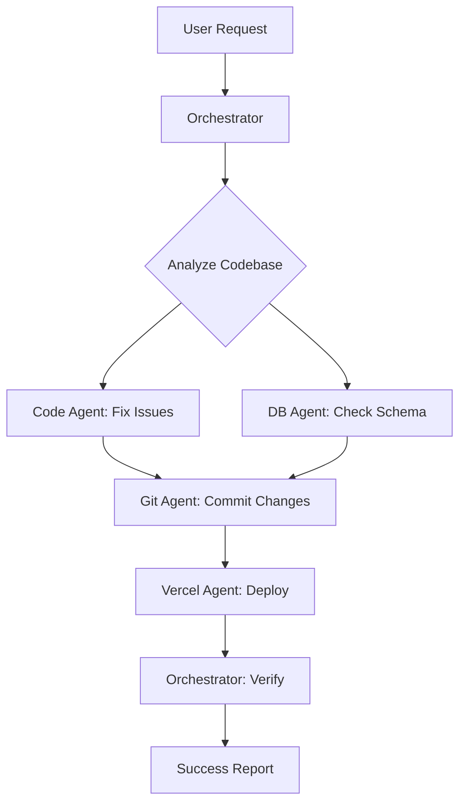

# Multi-Agent Deployment Architecture

## Overview
A coordinated system of specialized agents for efficient application deployment and maintenance.

## Agent Specifications

### 1. Git Agent (`git-ops`)
**Responsibilities:**
- Version control operations
- Commit management with semantic messages  
- Branch operations and merging
- Repository synchronization
- Conflict resolution

**Tools:**
- `git` commands
- GitHub/GitLab APIs
- SSH key management

**Example Actions:**
```bash
git add .
git commit -m "feat: add user authentication system

🤖 Generated with [Claude Code](https://claude.ai/code)

Co-Authored-By: Claude <noreply@anthropic.com>"
git push origin main
```

### 2. Vercel Deployment Agent (`vercel-ops`)
**Responsibilities:**
- Deployment orchestration
- Environment variable management
- Build monitoring and error handling
- Domain and alias configuration
- Performance optimization

**Tools:**
- Vercel CLI
- Vercel API
- Build log analysis

**Example Actions:**
```bash
vercel --prod
vercel env add DATABASE_URL
vercel domains add custom-domain.com
```

### 3. Code Quality Agent (`code-ops`) 
**Responsibilities:**
- Build error resolution
- TypeScript/ESLint fixes
- Dependency management
- Performance optimization
- Security vulnerability patches

**Tools:**
- npm/yarn/pnpm
- TypeScript compiler
- ESLint/Prettier
- Security scanners

**Example Actions:**
```bash
npm audit fix
tsc --noEmit
eslint --fix src/
```

### 4. Database Agent (`db-ops`)
**Responsibilities:**
- Schema migrations
- Seed data management
- Connection testing
- Backup operations
- Performance monitoring

**Tools:**
- Prisma CLI
- Database clients
- Migration scripts

**Example Actions:**
```bash
prisma migrate deploy
prisma db seed
prisma generate
```

### 5. Orchestrator Agent (`orchestrator`)
**Responsibilities:**
- Task coordination between agents
- Workflow state management
- Error recovery and rollback
- Progress reporting
- Decision making

**Communication Protocol:**
```typescript
interface AgentMessage {
  from: AgentType;
  to: AgentType;
  action: string;
  payload: any;
  status: 'pending' | 'in_progress' | 'completed' | 'failed';
  dependencies?: string[];
}
```

## Deployment Workflow



## Implementation Example

### Agent Class Structure
```typescript
abstract class DeploymentAgent {
  abstract name: string;
  abstract tools: string[];
  
  async execute(task: Task): Promise<TaskResult> {
    // Agent-specific implementation
  }
  
  async communicate(message: AgentMessage): Promise<void> {
    // Inter-agent communication
  }
}

class GitAgent extends DeploymentAgent {
  name = 'git-ops';
  tools = ['git', 'gh'];
  
  async commitAndPush(files: string[], message: string) {
    // Implementation
  }
}
```

### Orchestrator Logic
```typescript
class DeploymentOrchestrator {
  private agents: Map<string, DeploymentAgent>;
  private taskQueue: Task[];
  private state: WorkflowState;
  
  async deployApp(request: DeploymentRequest) {
    // 1. Analyze requirements
    const tasks = this.planDeployment(request);
    
    // 2. Execute tasks in parallel/sequence
    for (const task of tasks) {
      await this.executeTask(task);
    }
    
    // 3. Verify deployment
    await this.verifyDeployment();
  }
}
```

## Communication Patterns

### 1. Event-Driven
```typescript
// Agents subscribe to events
eventBus.on('build-failed', (data) => {
  codeAgent.fixBuildErrors(data.errors);
});

eventBus.on('deploy-complete', (data) => {
  orchestrator.reportSuccess(data.url);
});
```

### 2. Message Passing
```typescript
// Direct agent-to-agent communication
const result = await gitAgent.send(vercelAgent, {
  action: 'deploy',
  branch: 'main',
  commit: 'abc123'
});
```

### 3. Shared State
```typescript
// Centralized state management
interface DeploymentState {
  currentPhase: 'planning' | 'building' | 'deploying' | 'complete';
  tasks: Task[];
  errors: Error[];
  deploymentUrl?: string;
}
```

## Usage Commands

### Single Command Deployment
```bash
# Orchestrator handles everything
deploy-agents --auto --environment production

# With specific agents
deploy-agents --use git-ops,code-ops,vercel-ops --environment staging
```

### Interactive Mode
```bash
# Step-by-step with user approval
deploy-agents --interactive

# Monitor existing deployment
deploy-agents --monitor --deployment-id abc123
```

## Benefits

1. **Specialization**: Each agent focuses on specific domain expertise
2. **Parallelization**: Independent tasks run concurrently
3. **Error Recovery**: Isolated failures don't crash entire deployment
4. **Reusability**: Agents can be used in different workflow combinations
5. **Extensibility**: Easy to add new agents or modify existing ones
6. **Auditability**: Clear trail of actions and decisions

## Next Steps

1. **Prototype Implementation**: Build basic agent framework
2. **Tool Integration**: Connect agents to actual tools (git, vercel, etc.)
3. **Communication Layer**: Implement message passing system
4. **Error Handling**: Add robust recovery mechanisms
5. **UI Dashboard**: Create monitoring interface
6. **Testing**: Comprehensive agent and workflow testing